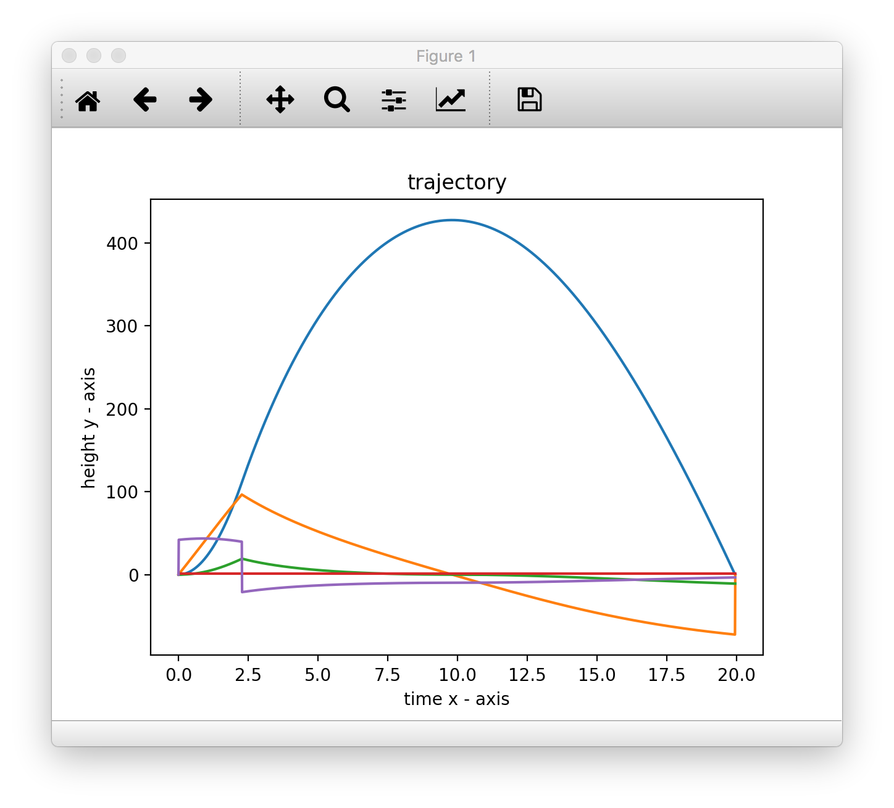

# Rocket_Sim
 1 dimensional newtonian physics based simulation engine
 
# Preview
Crashing into the Ground

* Blue: Height over time
* Purple: Acceleration
* Orange: Velocity
* Green: Drag / Air Resistance
* Red: Air Density  

Landing with Secondary Burn

* Blue: Height over time
* Green: Acceleration
* Orange: Velocity
* Red: Force

